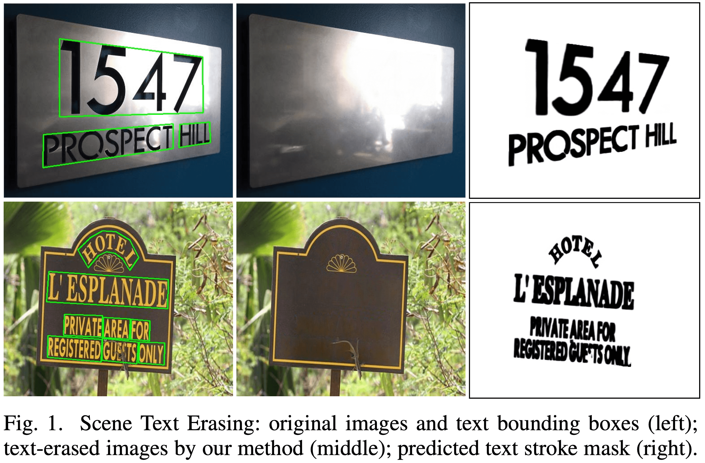

# Stroke-Based-Scene-Text-Erasing
This repository is a PyTorch implemention of following paper:

Stroke-Based Scene Text Erasing Using Synthetic Data for Training | [arxiv](https://arxiv.org/abs/2104.11493)

Zhengmi Tang, Tomo Miyazaki, Yoshihiro Sugaya, and Shinichiro Omachi.

Graduate School of Engineering, Tohoku University.



## Requirements
```
PyTorch==1.8.1
scikit_image==0.18.1
tqdm==4.55.1
torchvision==0.9.1
numpy==1.19.2
opencv-python==4.5.1.48
```
## Training
* perpare the training dataset root as:
```
--train_set
     |i_s
        | 1.jpg
        | 2.jpg
     |mask_t
        | 1.png
        | 2.png
     |t_b
        | 1.jpg 
        | 2.jpg
```
* tune the training parameters in cfg.py. If you want to funetune the model, turn the flag of finetune and resume both in True.
* run 
```
python train.py
```
## Testing
* perpare the format of testing data as  ./examples file shows. The names of txt files should be gt_img\_?.txt or res_img\_?.txt and the annotation of text bboxes should be in quadrilateral.
* download our retrained [pretrained model](https://drive.google.com/drive/folders/1J4hyPksRbanksId7AQzgMK2ANJZNN3qz?usp=sharing). (Note that we retrained our model in a different preprocessing strategy of training data for better visual perception. best.pth for real-world data testing and best_syn.pth for synthetic data testing)
* revise the model_path, src_img_dir and src_txt_dir with the right path in test.py
* run 
```
python test.py
```
## Evaluation
* perpare the names of result images and label images as same name, for example, img\_?.png or img\_?.jpg
* revise the result_path and label_path with the right path in eval.py
* run 
```
python eval.py
```
## Acknowledge
We thank [tanimutomo](https://github.com/tanimutomo/partialconv) for the excellent code.
